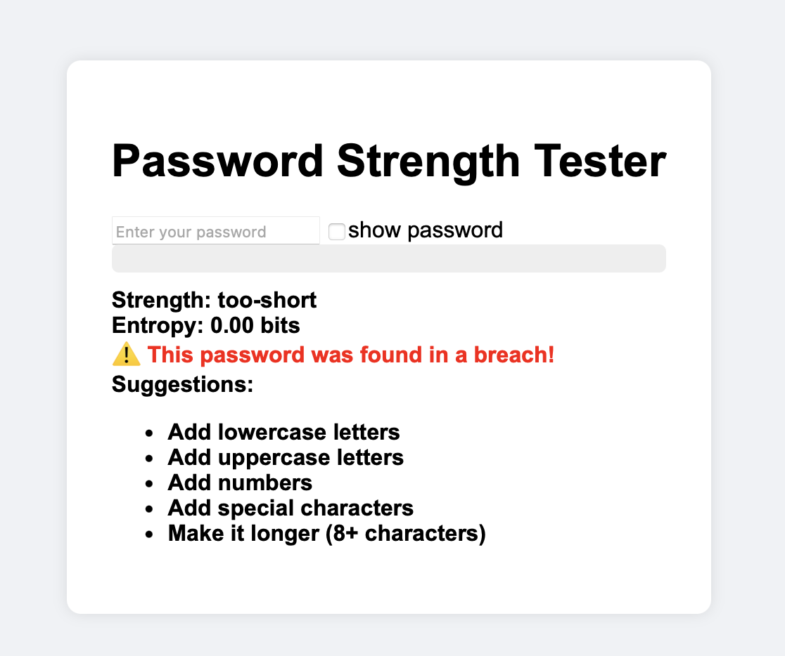
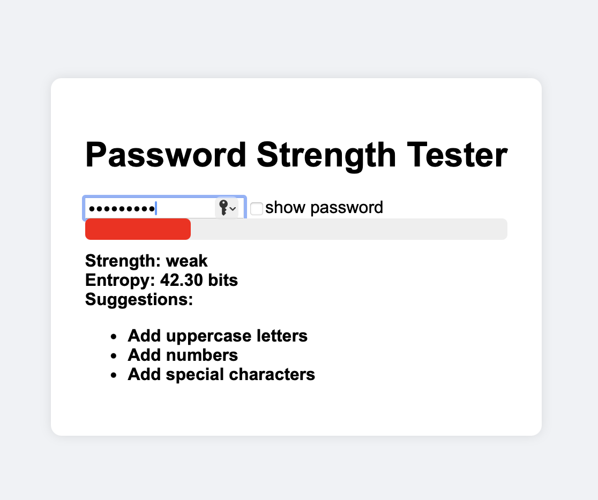
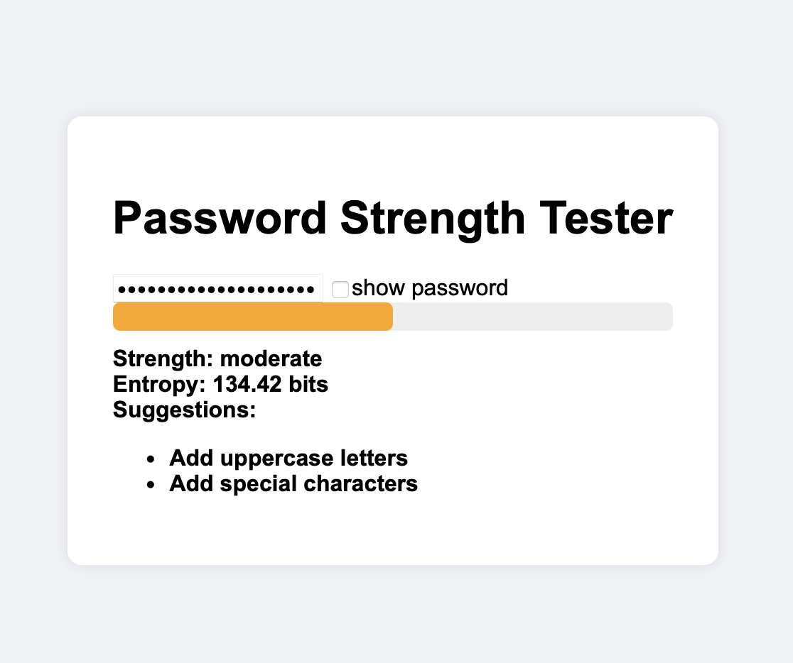
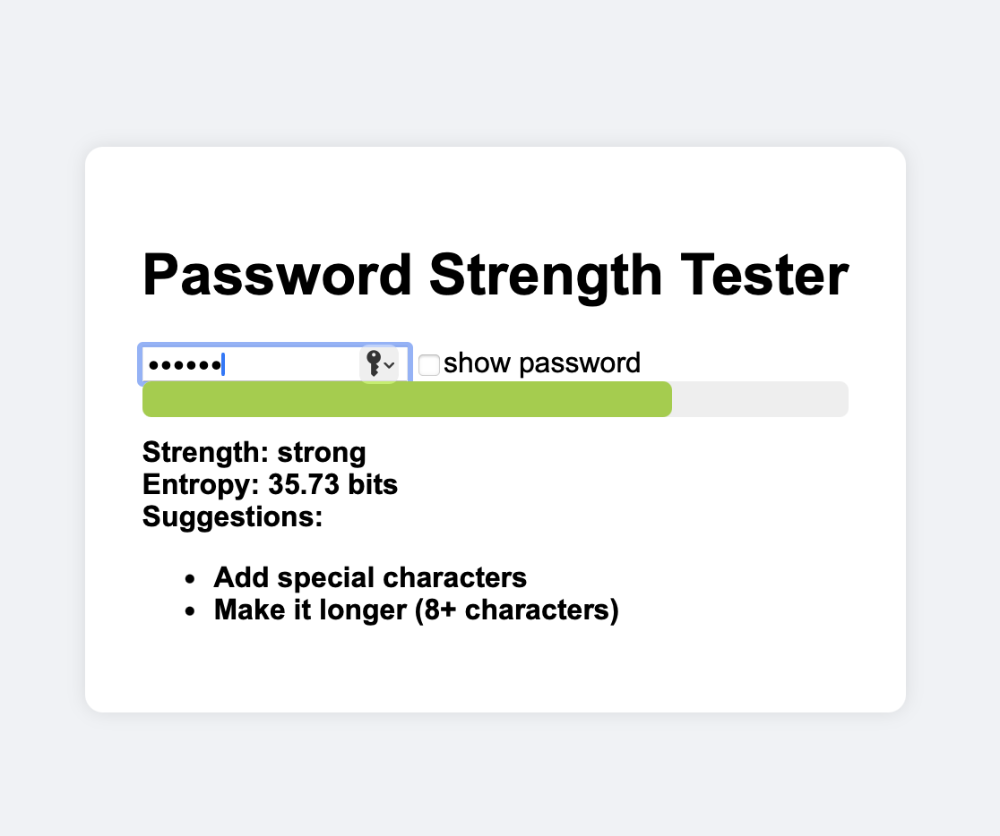
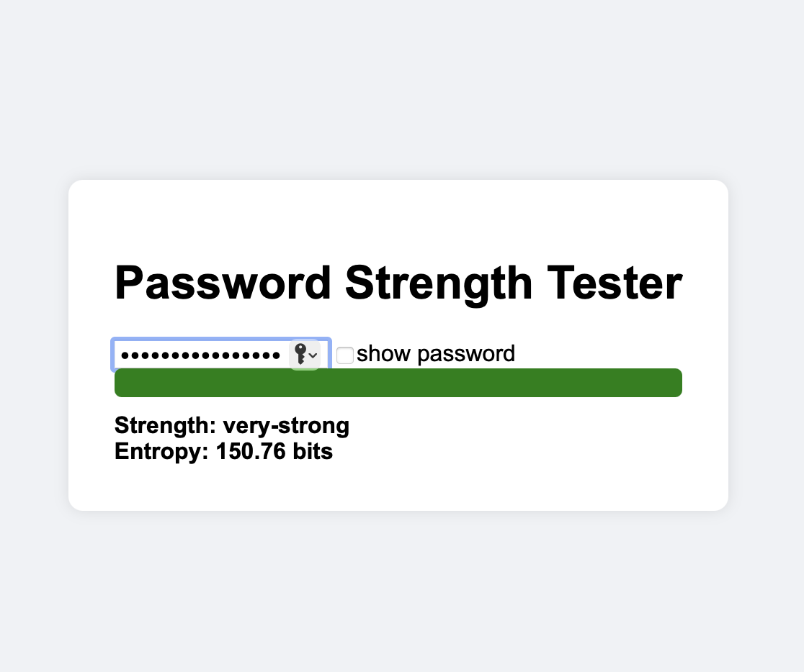

# 🔐 PassSniff

**PassSniff** is a modern, lightweight, and intercative **password strength tester** built for the web. It gives users
real-time feedback on password strength, entrophy, breach status (via Have I Been Pwned), and offers suggestions to l
level up  their security hygiene.
___

## 🚀 Features
- ✅ Real-time password strength evaluation
- 🧠 Entropy calculation based on character sets
- ⚠️ Breach check using the [Pwned Passwords API](https://haveibeenpwned.com/API/v3#PwnedPasswords)
- 💡 Actionable password improvement suggestions
- 🌈 Dynamic color-coded strength meter
- 👁️ Toggle password visibility
- 🧩 Clean, modular JavaScript — no frameworks required
___

## 🖼️ Demo Preview

 

| Too-short                   | Weak              | Moderate                  |Strong                       |Very-Strong                    | 
|-----------------------------|-------------------|---------------------------|-----------------------------|-------------------------------|
|  |  |  |        | |

 

## 🛡️Privacy & Security
- ✅Passwords are hashed in-browswer with SHA-1 (per HIBP API requirements)
- 🔐Nothing is logged or stored - everthing stays client-side
- 🔄Pwned checks are k-anoymized via range search (your full hash never leaves your device)

---

## 👨‍💻 Tech Stack
- Vanilla Javascript 
- HTML5 + CSS3
- [Have | Been  Pwned API](https://haveibeenpwned.com/API/v3#PwnedPasswords)
- SHA-1 hashing via crypto.subtle

---

## 📜 License
MIT License - use it, remix it, ship it. Just don't store raw password, ever.

---

## ✨ Author
Keashyn Naidoo

---
